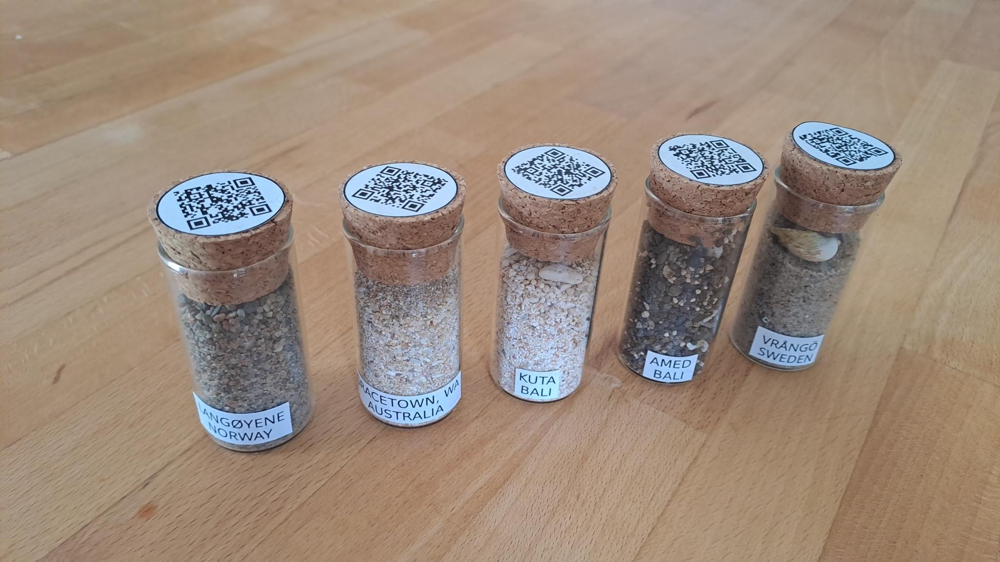

Automatic generation of labels for sand flasks
==============================================


Introduction
------------

This repository contains code that I use for automatically generating labels that I stick on sand flasks of my collection, shown in the picture below (click on it for an enlarged version of the image):



The QR code on the top of each cork plug contains a URL for Google Maps, which indicate the precise location where the sand in the respective flask was collected.


Prerequisites
-------------

The code in this repository is intended to be run on a Unix-like system. In particular, for a Debian-based system, the necessary software can be installed with the following commands:

```shell
sudo apt install make
sudo apt install inkscape
sudo apt install qrencode
```


How it works
------------

### The SVG template file

The appearance of the labels is controlled via the file [template.svg](template.svg). This SVG file can be edited with any vector graphic editor, like [Inkscape](https://inkscape.org/). It must contain, at least, three objects:

1. one text object with the rendered text “#TEXT1#”,
2. one text object with the rendered text “#TEXT2#”, and
3. an image object for inclusion of the PNG image of the QR code.

The two text objects will be rendered in the final PDF files with the same font, style, and size, as seen in the SVG file.

For the image object, the associated SVG element `<image>` must have the following properties:

```
sodipodi:absref="#DIR#/#STEM#.png"
xlink:href="#STEM#.png"
```

### The info files

For each desired label, a corresponding `.info` file must be created, containing a single line, with three fields, separated by semicolons, like this:

```
AMED;BALI;https://goo.gl/maps/oiXzww134QXGw1wa9
```

The texts in the the first two fields will appear in the place of the two text objects, replacing the “#TEXT1#” and “#TEXT2#”, respectively. The URL in the third field will be converted into a PNG file containing the QR code for that URL. 

### The resulting PDF files

Once the `.info` files are created, the associated PDF files are generated with the following command:

```shell
make
```

For the example shown above, a PDF file will be generated, which will contain the following content (actually, A4 PDF files are generated; the image below is a cropped version of the actual file):


Print the file, cut the labels, stick them to the flasks, and you are done!

### Tidying up

Finally, the directory can be cleaned with this command:

```shell
make clean
```


Author
------

Copyright © 2023  Rafael Laboissière <rafael@laboissiere.net>


License
-------

This project is licensed under the terms of the GNU GPL version 3.0 license.

<!---
Local Variables:
ispell-local-dictionary: "american"
eval: (auto-fill-mode -1)
eval: (visual-line-mode)
eval: (flyspell-mode)
End:
--->

<!--  LocalWords:  SVG PNG GPL Inkscape
 -->
